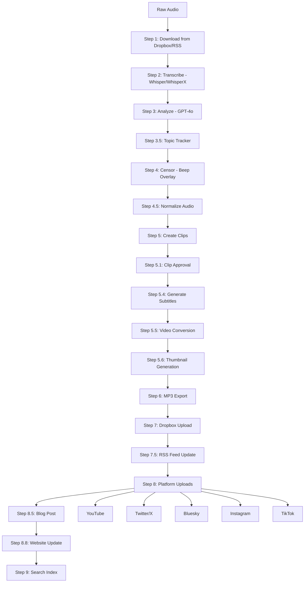

# System Architecture

## Architecture Pattern

Linear Pipeline Orchestration with Optional Module Pattern. The system is a CLI-driven sequential pipeline -- no web framework, no task queue, no background workers. Each pipeline step produces file artifacts on disk, and a checkpoint system enables crash recovery.

## Pipeline Steps

The full episode processing pipeline runs 18 steps in order:

| Step | Name | Module | Description |
|------|------|--------|-------------|
| 1 | Download | `dropbox_handler.py` | Download raw audio from Dropbox (or RSS feed, or local path) |
| 2 | Transcribe | `transcription.py` | Whisper/WhisperX speech-to-text with word-level timestamps |
| 3 | Analyze | `content_editor.py` | GPT-4o analysis: summary, chapters, clip timestamps, social captions, censor list |
| 3.5 | Topic Tracker | `google_docs_tracker.py` | Update Google Docs topic tracker (optional) |
| 4 | Censor | `audio_processor.py` | Overlay beep tones at flagged timestamps |
| 4.5 | Normalize | `audio_processor.py` | Adjust audio loudness toward LUFS target |
| 5 | Create Clips | `audio_processor.py` | Slice censored audio into 8 short clips |
| 5.1 | Clip Approval | `clip_previewer.py` | Interactive terminal UI for clip review |
| 5.4 | Subtitles | `subtitle_generator.py` | Generate SRT files from transcript timestamps |
| 5.5 | Video | `video_converter.py`, `audiogram_generator.py` | Convert clips to vertical MP4; create horizontal full-episode video |
| 5.6 | Thumbnail | `thumbnail_generator.py` | Generate 1280x720 PNG thumbnail via Pillow |
| 6 | MP3 | `audio_processor.py` | Convert censored WAV to MP3 |
| 7 | Dropbox Upload | `dropbox_handler.py` | Upload finished MP3 to Dropbox |
| 7.5 | RSS Feed | `rss_feed_generator.py` | Update `podcast_feed.xml` for Spotify/Apple |
| 8 | Platform Uploads | `uploaders/*` | Upload to YouTube, Twitter, Bluesky, Instagram, TikTok |
| 8.5 | Blog Post | `blog_generator.py` | Generate blog post from transcript + analysis |
| 8.8 | Website | `website_generator.py` | Update GitHub Pages landing page with latest episode data |
| 9 | Search Index | `search_index.py` | Index transcript into SQLite FTS5 |

## Pipeline Flowchart



## Component Map

### Infrastructure (cross-cutting)

| File | Purpose |
|------|---------|
| `config.py` | Central env var configuration, paths, constants, censorship word lists |
| `logger.py` | Singleton logger: console at INFO+, file at DEBUG+ |
| `pipeline_state.py` | Checkpoint/resume state (JSON per episode) |
| `retry_utils.py` | Exponential backoff decorator for network calls |
| `ollama_client.py` | Local LLM client (Ollama HTTP API) |

### CLI and Orchestration

| File | Purpose |
|------|---------|
| `main.py` | CLI entry point, `PodcastAutomation` orchestrator class |
| `pipeline/runner.py` | Pipeline step runner |
| `pipeline/context.py` | Pipeline context (shared state between steps) |
| `pipeline/steps/ingest.py` | Download/ingest step |
| `pipeline/steps/audio.py` | Audio processing steps |
| `pipeline/steps/analysis.py` | Content analysis step |
| `pipeline/steps/video.py` | Video conversion steps |
| `pipeline/steps/distribute.py` | Upload/distribution steps |

### Core Processing

| File | Purpose |
|------|---------|
| `audio_processor.py` | Censorship beep overlay, normalization, clip slicing, MP3 conversion |
| `audio_clip_scorer.py` | Score audio segments for clip quality |
| `transcription.py` | Whisper model loading and transcription |
| `diarize.py` | Speaker diarization via pyannote |
| `content_editor.py` | GPT-4o content analysis (prompts, parsing) |
| `video_converter.py` | FFmpeg WAV-to-MP4 (vertical/horizontal/square) |
| `video_utils.py` | Shared video utility functions |
| `subtitle_generator.py` | SRT generation from transcript timestamps |

### Content Generation

| File | Purpose |
|------|---------|
| `blog_generator.py` | Blog post from transcript + analysis |
| `thumbnail_generator.py` | Pillow-based 1280x720 PNG thumbnails |
| `audiogram_generator.py` | FFmpeg animated waveform clip videos |
| `clip_previewer.py` | Interactive terminal clip approval UI |
| `chapter_generator.py` | Chapter marker generation |
| `episode_webpage_generator.py` | Episode webpage generation (GitHub Pages) |
| `content_calendar.py` | 2-week content calendar with staggered posting |
| `daily_content_generator.py` | Daily content scheduling |
| `website_generator.py` | GitHub Pages landing page generator and deployer |
| `content_compliance_checker.py` | Content compliance validation |

### Distribution

| File | Purpose |
|------|---------|
| `uploaders/youtube_uploader.py` | YouTube Data API v3 (OAuth2) |
| `uploaders/twitter_uploader.py` | Twitter/X API v2 (tweepy) |
| `uploaders/bluesky_uploader.py` | Bluesky AT Protocol |
| `uploaders/instagram_uploader.py` | Instagram Graph API |
| `uploaders/tiktok_uploader.py` | TikTok API |
| `uploaders/spotify_uploader.py` | Spotify RSS submission |
| `uploaders/reddit_uploader.py` | Reddit posting (PRAW) |
| `dropbox_handler.py` | Dropbox download/upload (OAuth2, retry) |
| `rss_feed_generator.py` | RSS feed XML generation |
| `notifications.py` | Discord webhook notifications |
| `scheduler.py` | Per-platform upload delay scheduling |

### Analytics and Search

| File | Purpose |
|------|---------|
| `analytics.py` | YouTube/Twitter engagement metrics + scoring |
| `engagement_scorer.py` | Engagement scoring algorithms |
| `search_index.py` | SQLite FTS5 full-text episode search |

### Topic Engine (standalone)

| File | Purpose |
|------|---------|
| `topic_scraper.py` | Reddit/RSS topic scraping |
| `topic_scorer.py` | Ollama-powered topic scoring |
| `topic_curator.py` | Topic curation and deduplication |
| `track_episode_topics.py` | Track which topics were covered |

### Multi-Client and Outreach

| File | Purpose |
|------|---------|
| `client_config.py` | Multi-client YAML configuration loader |
| `prospect_finder.py` | Find potential podcast clients |
| `pitch_generator.py` | Generate pitches for prospects |
| `outreach_tracker.py` | Track prospect outreach status |
| `demo_packager.py` | Package demo materials for prospects |

## Data Flow

### Primary Episode Flow

```
Dropbox (raw .wav/.mp3)
  |
  v
downloads/{filename}                    -- Step 1: raw audio file
  |
  v
output/ep_N/{stem}_transcript.json      -- Step 2: words + segments + timestamps
  |
  v
output/ep_N/{stem}_analysis.json        -- Step 3: censor_timestamps, best_clips,
  |                                               episode_summary, social_captions,
  |                                               show_notes, chapters
  v
output/ep_N/{stem}_censored.wav         -- Step 4: beep tones at censor timestamps
  |                                     -- Step 4.5: LUFS normalized in place
  v
clips/ep_N/clip_1.wav ... clip_8.wav    -- Step 5: short audio clips
  |
  v
clips/ep_N/clip_1.srt ... clip_8.srt    -- Step 5.4: subtitle files
  |
  v
clips/ep_N/clip_1_vertical.mp4          -- Step 5.5: vertical video (9:16)
output/ep_N/{stem}_episode.mp4          -- Step 5.5: horizontal video (16:9)
  |
  v
output/ep_N/{stem}_thumbnail.png        -- Step 5.6: 1280x720 thumbnail
  |
  v
output/ep_N/{stem}_mp3.mp3              -- Step 6: final MP3
  |
  v
Dropbox (finished folder)              -- Step 7: uploaded MP3
output/podcast_feed.xml                -- Step 7.5: RSS feed
YouTube / Twitter / Bluesky / etc.     -- Step 8: platform uploads
output/ep_N/{stem}_blog.html           -- Step 8.5: blog post (HTML sanitized)
fakeproblemspodcast.github.io          -- Step 8.8: website landing page
output/episode_search.db               -- Step 9: FTS5 index
```

### Analysis Dict (Step 3 output, consumed by Steps 4-9)

The `analysis` dict is the primary data handoff between content analysis and all downstream steps:

```python
{
    "episode_title": "Episode Title",
    "episode_summary": "Summary text...",
    "censor_timestamps": [{"start": 12.5, "end": 13.1, "word": "..."}],
    "best_clips": [{"start": 45.0, "end": 75.0, "title": "Clip Title", "description": "..."}],
    "social_captions": {"youtube": "...", "twitter": "...", "instagram": "..."},
    "show_notes": "Show notes text...",
    "chapters": [{"start": 0, "title": "Introduction"}, ...],
    "quotes": ["Notable quote 1", "Notable quote 2"]
}
```

### Topic Engine Flow (separate from main pipeline)

```
Reddit/RSS feeds
  |  (topic_scraper.py)
  v
topic_data/scraped_topics_{date}.json
  |  (topic_scorer.py)
  v
topic_data/scored_topics_{date}.json
  |  (loaded by main.py at Step 3)
  v
Injected as topic_context into ContentEditor.analyze_content()
```

## Key Abstractions

### PodcastAutomation (Orchestrator)

The `PodcastAutomation` class in `main.py` is the central facade. It holds references to all component instances and drives the pipeline via `process_episode()`. CLI commands dispatch to methods on this class.

### Config (Centralized Configuration)

`config.py` defines the `Config` class with all configuration as class-level attributes loaded from env vars at import time. Never instantiated -- accessed via `Config.ATTRIBUTE_NAME`. All env var reads happen here (not scattered across modules).

### PipelineState (Checkpoint/Resume)

`pipeline_state.py` persists completed step names and their output file paths to `output/.pipeline_state/{episode_id}.json`. On `--resume`, completed steps are skipped and their outputs reloaded from state.

Key interface:
- `is_step_completed(step_name)` -- check if a step was already done
- `complete_step(step_name, outputs)` -- mark step done with output paths
- `get_step_outputs(step_name)` -- retrieve stored outputs for a completed step

### The `self.enabled` Pattern

Every optional feature module gates its behavior with an `enabled` flag set in `__init__`:

```python
class FeatureClass:
    def __init__(self):
        self.enabled = os.getenv("FEATURE_ENABLED", "true").lower() == "true"

    def do_work(self):
        if not self.enabled:
            logger.warning("Feature disabled")
            return False
        # actual work here
```

This pattern ensures missing credentials or disabled features never crash the pipeline -- they log a warning and return early.

### Uploaders Package

Each platform uploader in `uploaders/` handles its own OAuth2 authentication and raises `ValueError` on missing credentials. The orchestrator catches these during initialization and excludes unconfigured platforms.

Available uploaders: YouTube, Twitter/X, Bluesky, Instagram, TikTok, Reddit, Spotify (RSS).

## Distribution Layer

### Content Calendar

`content_calendar.py` manages a 2-week content calendar that staggers YouTube Shorts releases across 14 days. Rather than posting all clips on day one, it distributes them for sustained engagement.

Key behaviors:
- **Retry logic:** Failed slots retry up to 3 times (tracked via `retry_count`)
- **Per-platform tracking:** Each platform records success/failure independently; partial success marks the slot as uploaded
- **Scheduling tolerance:** 5-minute grace window on slot scheduling times
- **Timezone safety:** Datetime comparisons strip tzinfo to avoid naive/aware mismatches

### Scheduled Posting

`scheduler.py` supports per-platform upload delays and optimal posting hours:
- YouTube: default 2 PM local time
- Twitter: default 10 AM local time
- Instagram: default 12 PM local time
- TikTok: default 12 PM local time

Delays are configurable via `SCHEDULE_{PLATFORM}_DELAY_HOURS` env vars.

### Discord Notifications

`notifications.py` sends webhook notifications for pipeline events (episode processed, uploads completed, errors). Enabled only when `DISCORD_WEBHOOK_URL` is set.

### GitHub Actions Automation

Two GitHub Actions workflows automate content distribution:

| Workflow | File | Schedule | Purpose |
|----------|------|----------|---------|
| Scheduled Content Posting | `.github/workflows/scheduled-content.yml` | Daily 10 AM ET | Posts pending content calendar slots (YouTube Shorts, Twitter, Bluesky), commits calendar state updates |
| Daily Fake Problem | `.github/workflows/daily-content.yml` | Daily 12 PM ET | Generates and posts daily content via OpenAI + Twitter |

Both workflows support `workflow_dispatch` for manual triggering and upload run artifacts for debugging.

### Website Generator

`website_generator.py` (Step 8.8) rebuilds the static landing page for [fakeproblemspodcast.com](https://fakeproblemspodcast.com) after each episode is processed. It collects all episode analysis files, generates an HTML index page, and deploys it to the GitHub Pages repository (`fakeproblemspodcast/fakeproblemspodcast.github.io`) via the GitHub API. Gated by `WEBSITE_ENABLED` and requires `GITHUB_TOKEN`.

## Security

A full security audit was completed on 2026-04-03 covering all Python source files. Results:

- **0 Critical, 0 High, 1 Medium, 7 Low** findings across 20 vectors tested
- **STRIDE coverage:** 5/6 categories | **OWASP coverage:** 8/10 categories
- **Medium finding (fixed):** Blog generator HTML sanitization -- LLM-generated markdown is now sanitized via `_sanitize_html()` before saving to prevent XSS from prompt injection or hallucinated script tags
- **Accepted risks:** Pickle deserialization for YouTube tokens (local files only), no request timeouts on some uploaders (self-DoS only), static API credentials (standard for Twitter/Bluesky)
- All SQL queries are parameterized, all YAML uses `safe_load`, all HTML generation escapes dynamic content, subprocess calls use list form

Full audit report: `security/260403-1430-full-pipeline-audit/`

## Error Handling Strategy

- **Pipeline lock:** PID-based lock file at `output/.pipeline_lock` prevents concurrent pipeline runs. Lock is acquired at startup and released on completion or crash
- **Required services** (Dropbox, OpenAI): raise `ValueError` in `__init__`, caught by `Config.validate()` before pipeline starts
- **Optional uploaders** (YouTube, Twitter, etc.): raise `ValueError` if unconfigured, caught during initialization, excluded from upload list
- **Each upload step**: wrapped in `try/except Exception`, logs error, records `{"status": "error"}`, continues pipeline
- **Network operations**: `retry_with_backoff` decorator (3 retries, exponential backoff) on Dropbox calls
- **Pipeline-level errors**: bubble up to `main()`, top-level `try/except` prints traceback and exits with code 1

## Logging

All modules use `from logger import logger` (Python `logging` singleton):
- Console: INFO+ to stdout
- File: DEBUG+ to `output/podcast_automation.log`
- Format: `YYYY-MM-DD HH:MM:SS [LEVEL] message`
- Always `%s` formatting in log calls, never f-strings
